# 问题

## 2D 空间内曲面的相交判定

1. 设计一个函数，用于判断 2D 空间内的两个任意多边形是否有重叠，并返回重叠的区域。可以自由设计表示多边形的数据结构。
2. (optional) 基于小问 1 给出的函数，如果在 2D 空间内有大量的多边形，如何快速判断它们是否有重叠？请给出你的设计思路和算法。

# 回答

1. 实现了2D空间中两个任意多边形的求交集的算法
2. 使用Dynamic Tree来划分管理2D空间，Dynamic Tree构建在多边形的轴对齐包围盒AABB上。 当2D空间中有大量多边形时，能够使用加速结构快速判断多边形是否与其他多边形相交，并给出相交区域。

# **算法结果：**

针对问题1、2给出了自己的算法结果如下：

## **任意两个2D多边形求交：**


## **使用Dynamic Tree加速求交：**


本人专门写了一个项目来验证算法的有效性，2D多边形求交算法是一个独立的模块，为了将算法结果可视化出来使用了OpenGl进行可视化展示, 项目如下：

## PolygonDemo

**项目地址**：https://github.com/271812697/PolygonDemo

**项目结构**：

主要包括两个部分:

1.Extern，使用第三方库为OpenGL窗口的创建提供支持

2.Source,  任意2D多边形相交以及Dynamic Tree的核心实现

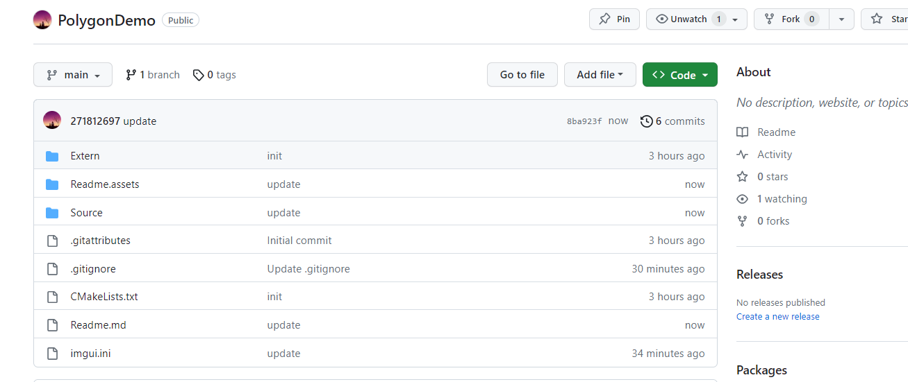

**Extern:**

使用了glad、glfw、imgui、等第三方库，使用OpenGl创建一个窗口，用来可视化2D多边形的算法的结果。

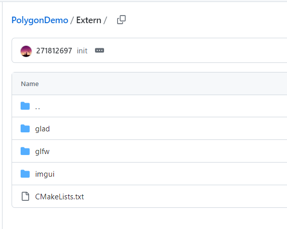

**Source**

核心算法的实现部分：

1.判断 2D 空间内的两个任意多边形是否有重叠，并返回重叠的区域

2.使用 Dynamic Tree来划分2D空间,管理多边形，可以快速判断多边形相交

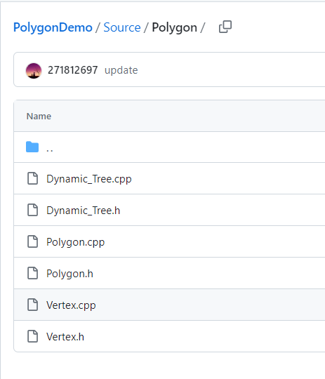

**构建项目**

**可以直接使用以下命令构建：**

```bash
git clone https://github.com/271812697/PolygonDemo.git
cd PolygonDemo/
mkdir Build
cd Build/
cmake ..
```

cmake 构建好会生成sln解决方案，使用vs打开即可


**使用说明：**

1. 鼠标右键按住不放拖动屏幕。
2. 鼠标靠近多边形顶点时，左键按住不放可以拖动多边形的顶点。
3. 鼠标滚轮可以缩放屏幕


# 算法的核心实现

### 数据结构的定义：

主要使用六个源码文件定义了以下数据结构：

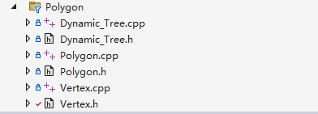

2D空间中的顶点与向量Vertex、Vec2：


线段LineSegment：

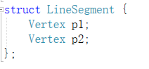

任意多边形Polygon：


轴对齐包围盒AABB：

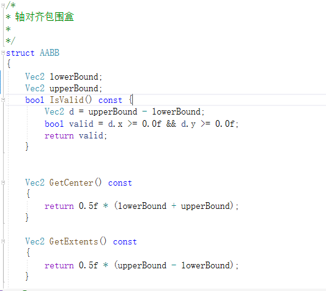

### 求交算法

如下展示了，本文实现两个任意多边形相交算法的可视化结果

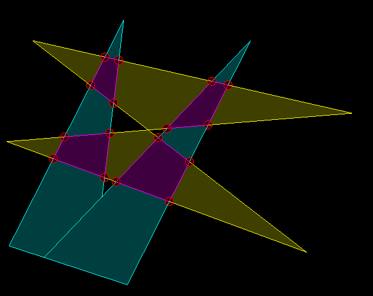


#### 两个任意多边形求交算法：

原型

```c++
bool IntersectionPolygons(struct Polygon& polygon1, struct Polygon& polygon2, std::vector<struct Polygon>&ans)
```


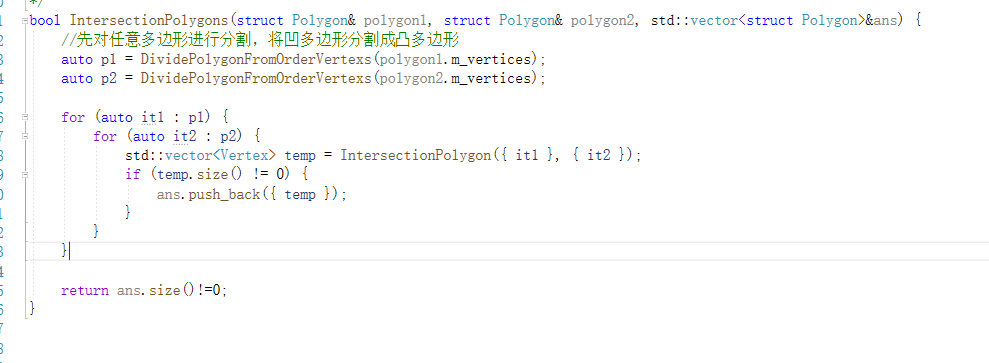

其思路为：


#### 凹多边形分割算法：

如图对多边形分割，先找到凹陷的地方，再进行分割


基本过程为：

1. 顺着多边形的边进行遍历，
2. 利用叉积来判断两条边的夹角，若大于180度则以这条边切割多边形，
3. 对得到的两个新的多边形递归分割，汇总结果

算法实现

```c++
/*
* 将凹多边形分割成凸多边形
* 先检查是否是凹多边形，若是则进行分割操作
*/
std::vector<std::vector<Vertex>> DividePolygonIfConcave(std::vector<Vertex> _points, bool _antiClockwise);

```


#### 两个凸多边形求交算法：

基本过程为：

1. 收集两个多边形的边的交点
2. 收集包含在另一个多边形内部的顶点
3. 顶点排序，返回交集

```c++
std::vector<Vertex> IntersectionPolygon(struct Polygon polygon1, struct Polygon polygon2);
```


边求交：

两条线段利用叉积来判断是否相交，若相交根据数学公式算出交点

```c++
std::vector<Vertex> IntersectionLine(LineSegment line1, LineSegment line2);
```


判断顶点是否在多边形内部：

利用点射法，从顶点引一条射线，判断这条射线与多边形的边的交点个数。

1. 奇数在多边形内部
2. 偶数在多边形外部

```c++
bool VertexInPolygon(Vertex v, std::vector<LineSegment>lines);
```


顶点排序：

1. 算出所有顶点的几何中心
2. 按照顶点与几何轴心构成的夹角大小来排序

```c++
/*
* 判断顶点a、b分别与center构成的夹角
*/

bool VertexCmp(const Vertex& a, const Vertex& b, const Vertex& center) {

    //向量OA和向量OB的叉积
    int det = (a.x - center.x) * (b.y - center.y) - (b.x - center.x) * (a.y - center.y);
    float angle_a = atan2(a.y - center.y, a.x - center.x);
    float angle_b = atan2(b.y - center.y, b.x - center.x);
    return angle_a < angle_b;
}
```

### Dynamic Tree


类似于BVH树，Dynamic Tree使用树形结构的方式管理了2D空间，多边形将自己的轴对齐包围盒交AABB给Dynamic Tree, Dynamic Tree为所有的轴对齐包围盒构建一颗平衡二叉树，从而降低了多边形在场景中查找与其相交的多边形的复杂度。

如下图，是本人实现的一个Dynamic Tree管理2D空间的可视化展示。

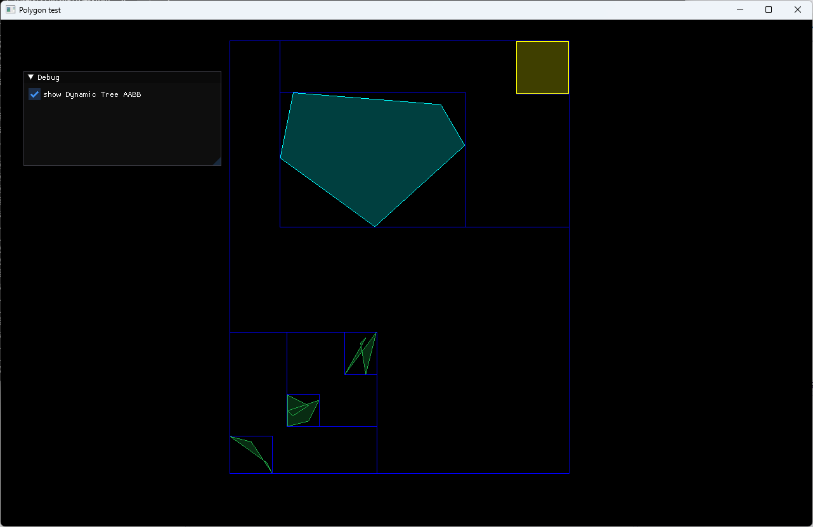

当一个2D场景中有大量的多边形时(假设为n个)，对于一个多边形要在场景中找出与其相交的多边形时：

**1.顺序查找**

当不使用加速结构去管理空间，需要顺序查找每一个多边形并与其求交，平均复杂度为：
$$
% MathType!MTEF!2!1!+-
% feaahqart1ev3aaatCvAUfeBSjuyZL2yd9gzLbvyNv2CaerbuLwBLn
% hiov2DGi1BTfMBaeXatLxBI9gBaerbd9wDYLwzYbItLDharqqtubsr
% 4rNCHbWexLMBbXgBd9gzLbvyNv2CaeHbl7mZLdGeaGqipCI8Ffeu0d
% Xdh9vqqj-hEeeu0xXdbba9frFj0-OqFfea0dXdd9vqaq-JfrVkFHe9
% pgea0dXdar-Jb9hs0dXdbPYxe9vr0-vr0-vqpWqabeaabiqaceaaca
% qabeaadaqaaqaafaGcbaGaae4taiaacIcacaWGUbGaaiykaiabgEna
% 0kaabMeacaqGUbGaaeiDaiaabwgacaqGYbGaae4CaiaabwgacaqGJb
% GaaeiDaiaabMgacaqGVbGaaeOBaiaabIcacaqGPaaaaa!50D5!
{\rm{O}}(n) \times {\rm{Intersection}}
$$
其中Intersection为多边形的求交操作的复杂度

**2.使用Dynamic Tree**

当使用Dynamic Tree时，Dynamic用平衡二叉树对2D空间进行了划分，2D空间中每一个多边形通过其AABB注册到Dynamic Tree上成为叶节点。

多边形的求交操作就是对平衡二叉树进行查找的过程，查找从根节点开始进行遍历：

1. **若当前遍历的节点是叶节点，则与叶节点所管理的多边形进行求交操作，若不是叶节点则执行2、3**
2. **若多边形的AABB与当前节点的AABB不相交，则终止查找，省去了与这个节点AABB所管理的所有多边形的查找操作**
3. **若多边形的AABB与当前节点的AABB相交,则继续到，左右子树上查找，递归重复这个过程**

时间复杂度为：
$$
% MathType!MTEF!2!1!+-
% feaahqart1ev3aaatCvAUfeBSjuyZL2yd9gzLbvyNv2CaerbuLwBLn
% hiov2DGi1BTfMBaeXatLxBI9gBaerbd9wDYLwzYbItLDharqqtubsr
% 4rNCHbWexLMBbXgBd9gzLbvyNv2CaeHbl7mZLdGeaGqipCI8Ffeu0d
% Xdh9vqqj-hEeeu0xXdbba9frFj0-OqFfea0dXdd9vqaq-JfrVkFHe9
% pgea0dXdar-Jb9hs0dXdbPYxe9vr0-vr0-vqpWqabeaabiqaceaaca
% qabeaadaqaaqaafaGcbaGaciiBaiaac+gacaGGNbGaaiikaiaaikda
% caWGUbGaeyOeI0IaaGymaiaacMcacqGHxdaTcaqGjbGaaeOBaiaabs
% hacaqGLbGaaeOCaiaabohacaqGLbGaae4yaiaabshacaqGPbGaae4B
% aiaab6gacaqGOaGaaeykaaaa!5537!
\log (2n - 1) \times {\rm{Intersection}}
$$
其中2n-1代表平衡二叉树的节点的数目，所有的多边形都用叶节点来管理，叶节点有n个，每一个非叶节点有两个孩子节点，故而节点总数目为2n-1。


#### 数据结构

节点定义：

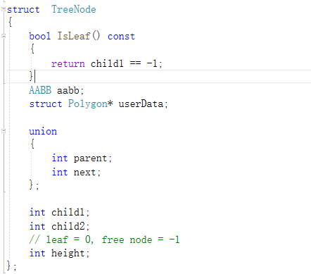

树的定义：

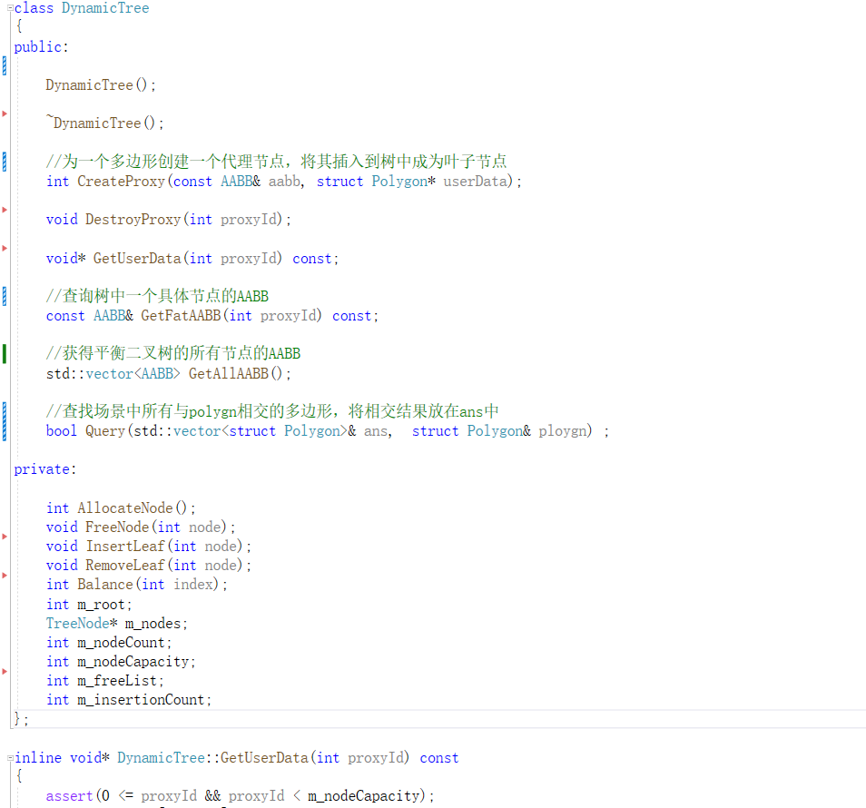

#### 管理2D多边形,加速求交：

使用示例如下:

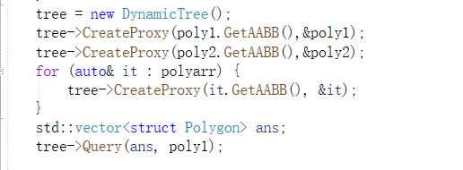

##### 注册多边形到Dynamic Tree中：

首先从节点数组中分配一个空闲节点，填入相应的代理信息，然后使用插入操作，插入到平衡二叉树中

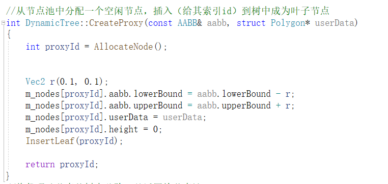

##### 插入叶子节点：


##### 求交操作：

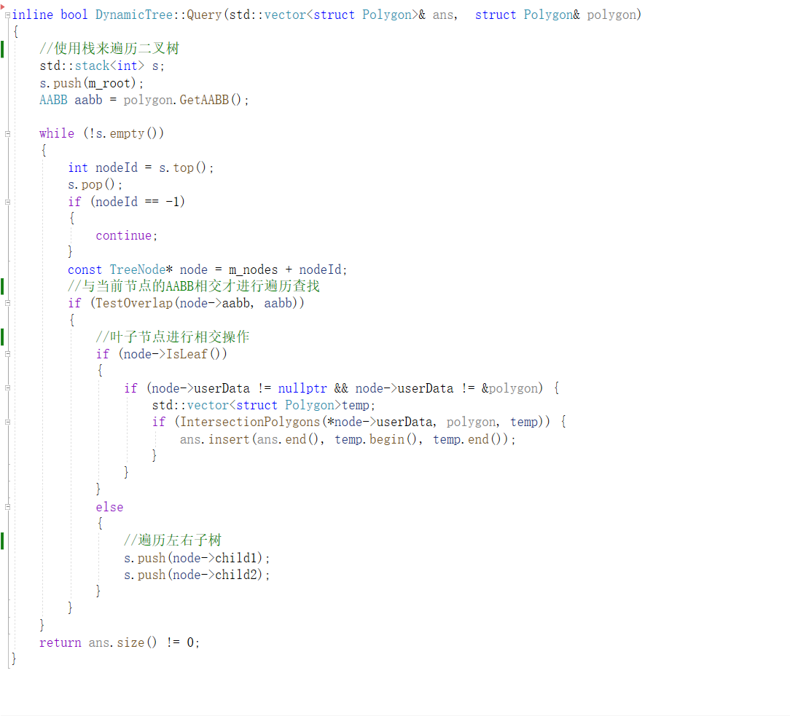